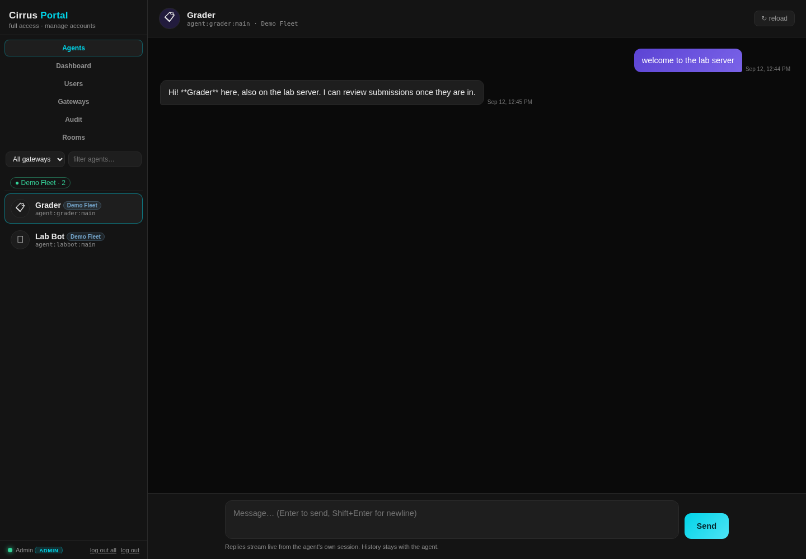

# Cirrus Portal 🐯

**Mission control for your OpenClaw fleet.** A browser console that talks
**directly to OpenClaw agents** — no Telegram, no channel plugins. Open it, pick
an agent, and you're chatting with that agent's **main session**
(`agent:<agentId>:main`). History is the agent's real session history; replies
stream live.

> **Product family:** Cirrus · **engine:** Cirrus Core · **console:** Cirrus Portal.
> Canonical strings: [`branding.json`](branding.json) · naming rationale:
> [`NAMING.md`](NAMING.md).



Cirrus Portal is **single-tenant, self-hosted** — one organization per install.
Supported platforms and explicit non-goals are in [`DEPLOYMENT.md`](DEPLOYMENT.md).

---

## What it does

- **Chat with any agent's main session**, with live streaming replies and real
  session history.
- **Accounts & roles** — `admin`, `instructor`, `student`; students see only
  their assigned agents, enforced server-side on every endpoint.
- **Multi-gateway** — merge several OpenClaw gateway servers into one agent
  list; namespaced sessions so same-named agents never collide.
- **Group chat (panel mode)** — rooms of 2+ agents in rounds or free-flow.
- **Tool receipts & approvals** — see tool runs live; staff resolve approval
  requests from the chat.
- **Course context injection** — optional per-student/assignment context and
  per-assignment tool policy (flag + audit).
- **Audit log & dashboard** — every login/send/account change is recorded; stat
  tiles and activity for admins.
- **Observability built in** — `/healthz` + `/readyz` probes, structured JSON
  request logs with `X-Request-Id`, and a Prometheus `/metrics` endpoint.
- **Secure by default** — no default credentials, loopback bind, TLS-gated
  public exposure, hardened non-root container.

See the screenshots: [`docs/screenshots/`](docs/screenshots/).

---

## Quickstart

**Requirements:** a Linux server (Debian 12/13 or Ubuntu 22.04/24.04, x86_64)
running an **OpenClaw gateway on `127.0.0.1:18790`**, with **Docker + Compose v2**
and **> 500 MB** free disk. That's it — no build step, no runtime dependencies
beyond the container.

```bash
# 1. Get the release onto the server:
scp dist/cirrus-portal-<version>.tar.gz user@server:/tmp/

# 2. Install (auto-detects the gateway token, generates a strong admin password):
ssh user@server 'cd /tmp && tar xzf cirrus-portal-<version>.tar.gz \
  && cd cirrus-portal-<version> && ./install.sh install --firewall'

# 3. Verify:
./install.sh status
```

Then open **`http://127.0.0.1:18800`** (loopback default — tunnel in over SSH)
and log in as `admin` with the password saved to `portal-credentials.txt`
(0600). **Change it after first login** and delete that file.

- First install on a new server? [`REPLICATION.md`](REPLICATION.md) walks through it.
- Public install with automatic HTTPS:

  ```bash
  ./install.sh install --domain portal.example.com --email you@example.com
  # portal stays on loopback; Caddy terminates TLS on 80/443 with Let's Encrypt
  ```

### No default credentials, ever

A fresh box either **mints a unique admin password** (installer/headless) or, if
nothing is configured, starts in **setup mode** and serves a first-run wizard at
`/setup`. The server **refuses to boot** if an admin account still uses a
known-default password. Passwords must clear the policy everywhere (12+ chars,
upper + lower + a number, not the username, not a known default, not blocklisted).

---

## TLS & public exposure

The portal is **secure by default**: it binds `127.0.0.1` (loopback) and
**refuses to bind a public interface without TLS** unless you explicitly opt
out. Three supported ways to expose it:

```bash
# 1. Automatic HTTPS with Caddy (recommended) — the installer wires it up:
./install.sh install --domain portal.example.com --email you@example.com

# 2. Bring your own certificate (the portal serves HTTPS itself):
./install.sh install --tls-cert /etc/ssl/fullchain.pem --tls-key /etc/ssl/privkey.pem

# 3. Your own TLS-terminating proxy, then trust it (trustProxy:true):
#    nginx template: deploy/nginx/cirrus-portal.conf
```

When TLS is in play, session cookies become `Secure; HttpOnly; SameSite=Strict`
and responses carry `Strict-Transport-Security`. Cleartext on a public interface
is refused at boot; the only override is the explicit, loudly-warned
`--insecure-plaintext` (trusted LAN or tunnel — never the open internet).
Firewall: `--firewall` opens the right port(s) in `ufw`.

---

## Operations

```bash
./install.sh install             # detect → configure → build → run
./install.sh upgrade             # rebuild from current code, keep all state
./install.sh migrate [--dry-run] # 2.x → 3.x schema migration (backup-first)
./install.sh status              # scriptable health check (exit 0/1)
./install.sh doctor              # deep diagnostics
./install.sh backup              # state+config snapshot → ./backups/ (encrypted when a passphrase is set)
./install.sh restore FILE        # restore a snapshot (.tar.gz or encrypted .gpg/.enc)
./install.sh uninstall [--purge] # stop container (optionally delete files)

# Encrypted backups + disaster recovery (./backup.sh):
./backup.sh create --with-secrets # AES-256 archive incl. secrets → ./backups/
./backup.sh verify FILE           # integrity-check an archive, no live effect
./backup.sh drill                 # prove a clean-VM restore (RTO evidence)
./backup.sh schedule --install    # recurring encrypted backups (systemd timer / cron)
```

The full operator runbook is [`ADMIN.md`](ADMIN.md). Upgrades (including the
2.x → 3.x drill and the automated `./install.sh migrate`) are in
[`UPGRADING.md`](UPGRADING.md). Backup/restore/disaster-recovery — including the
RPO/RTO targets and the clean-VM restore drill — is in
[`docs/DR-DRILL.md`](docs/DR-DRILL.md). When something breaks, start at
[`TROUBLESHOOTING.md`](TROUBLESHOOTING.md).

`release.sh` builds the versioned, **reproducible**, checksummed distribution
(`dist/cirrus-portal-<ver>.tar.gz` + `SHA256SUMS` + a CycloneDX **SBOM`) containing
only code + installer + docs — **never per-server state or secrets**. Pass a GPG
key (`RELEASE_GPG_KEY`) to also produce a signed `SHA256SUMS.asc`. The build is
byte-identical for the same tree; the publish checklist is [`RELEASING.md`](RELEASING.md).

### Observability

The server ships liveness/readiness probes, structured logs, and Prometheus
metrics — no external agent required:

| Endpoint | Purpose | Access |
| --- | --- | --- |
| `GET /healthz` | Liveness — `200` while the process is up (incl. setup mode) | open |
| `GET /readyz` | Readiness — `200` when serving; `503` while the setup wizard is pending | open |
| `GET /metrics` | Prometheus text metrics (requests, sessions, gateways, users, logins) | loopback, or admin when `metricsPublic:false` |

Every request gets an `X-Request-Id` (echoed from the caller, else minted) and
one structured **JSON log line** on completion (method, path, status, duration,
request id, client IP). Set `"logFormat": "text"` for human-readable lines, or
`"logRequests": false` to silence access logs. `./install.sh status` and
`doctor` now probe `/healthz` + `/readyz` and report the log format. Point your
scraper at `http://127.0.0.1:18800/metrics`.

---

## Configuration

`portal-config.json` is **token-free**:

```json
{
  "port": 18800,
  "bind": "127.0.0.1",
  "publicBind": false,
  "gateways": [
    { "id": "home", "name": "Home", "url": "ws://127.0.0.1:18790", "enabled": true }
  ],
  "tlsMode": "auto",
  "trustProxy": true,
  "sessionTtlHours": 12,
  "sessionIdleMinutes": 0,
  "loginMaxAttempts": 5,
  "loginWindowSeconds": 900,
  "loginLockoutSeconds": 300,
  "logFormat": "json",
  "logRequests": true,
  "metricsPublic": false
}
```

Gateway tokens and the first-run admin password live in **`portal-secrets.json`**
(0600) — never committed, backed up, or shipped. Token precedence per gateway:
`PORTAL_GATEWAY_TOKEN_<ID>` env → `portal-secrets.json` → legacy config `token`
(auto-migrated on boot, then stripped) → `GATEWAY_TOKEN` env.
`./secret-scan.sh` (and CI) greps the repo + a built tarball for leaked
secrets; `./install.sh doctor` checks the secrets mode and that the config
stayed token-free.

Gateways can also be managed live from the UI (admin → **Gateways**): add,
edit, enable/disable, remove — tokens are write-only in the API.

---

## Roles

| Role | Sees | Can do |
| --- | --- | --- |
| `admin` | all agents | everything + manage accounts + view the audit log |
| `instructor` | all agents | chat + student roster view |
| `student` | assigned agents only | chat with those agents |

Accounts live in `portal-users.json` (scrypt-hashed, 0600). Agent access is
enforced server-side on every endpoint. Sessions are CSRF-protected, rotate on
login, and support `logout-all`; logins are rate-limited with progressive
lockout.

---

## Architecture

```
Browser ──HTTP/SSE──▶ portal-server.js ──WebSocket (loopback)──▶ OpenClaw gateway (:18790)
                            │
                            └─ device-signed operator connection (operator.read/write)
```

- The server holds the gateway token — **the browser never sees it**.
- It connects to the gateway over loopback with a persistent Ed25519 device
  identity (`portal-device.json`), so the gateway treats it as a trusted
  operator client.
- The container runs **non-root** (uid 10001), with a read-only root filesystem,
  dropped capabilities, resource limits, and a healthcheck.

---

## Development

There is no build step and no third-party toolchain — the portal is plain Node
plus a static UI. The repo ships its own checks:

```bash
./run-tests.sh    # node:test suite (auth, RBAC, rooms, config, route smoke) + smoke tests
./lint.sh         # JS/shell syntax, JSON validity, line endings
./release.sh      # reproducible dist/cirrus-portal-<version>.tar.gz + SHA256SUMS + SBOM
./secret-scan.sh  # grep the repo (or a built tarball) for leaked secrets
```

Cutting a release is a checklist: see [`RELEASING.md`](RELEASING.md). Notable
changes per version are in [`CHANGELOG.md`](CHANGELOG.md).

CI ([`.github/workflows/ci.yml`](.github/workflows/ci.yml)) runs **lint → test →
secret-scan** on every push and pull request, then builds and uploads the
versioned release artifact.

---

## Documentation

| Doc | What it covers |
| --- | --- |
| [`ADMIN.md`](ADMIN.md) | Operator runbook — install, backup, secrets, users, gateways, TLS, incidents |
| [`DEPLOYMENT.md`](DEPLOYMENT.md) | Deployment model + tenancy + supported/unsupported platforms |
| [`REPLICATION.md`](REPLICATION.md) | Installing on N servers (fleet recipe) |
| [`UPGRADING.md`](UPGRADING.md) | Upgrade + 2.x → 3.x migration drill |
| [`TROUBLESHOOTING.md`](TROUBLESHOOTING.md) | Symptom → cause → fix |
| [`docs/DR-DRILL.md`](docs/DR-DRILL.md) | Encrypted + scheduled backups and the clean-VM restore drill (RPO/RTO) |
| [`THREAT-MODEL.md`](THREAT-MODEL.md) | What it protects, from whom, and residual risk |
| [`SECURITY.md`](SECURITY.md) | How to report a vulnerability |
| [`ACCEPTABLE-USE.md`](ACCEPTABLE-USE.md) | Public-host baseline and prohibited uses |
| [`CHANGELOG.md`](CHANGELOG.md) | What changed in each release (Keep a Changelog) |
| [`RELEASING.md`](RELEASING.md) | Release checklist — build, sign, verify, tag, publish |
| [`docs/screenshots/`](docs/screenshots/) | Screenshots + the reproducible capture pass |

---

## License & legal

Cirrus Portal is licensed under the **Apache License, Version 2.0**.
© 2026 CRPerdue Technologies, LLC.

- [`LICENSE`](LICENSE) — Apache-2.0 full text
- [`NOTICE`](NOTICE) — attribution + Cirrus trademark reservation
- [`THIRD-PARTY-NOTICES.md`](THIRD-PARTY-NOTICES.md) — dependency inventory (zero bundled third-party code)
- [`SECURITY.md`](SECURITY.md) — how to report a vulnerability, and what to expect
- [`ACCEPTABLE-USE.md`](ACCEPTABLE-USE.md) — public-host baseline and prohibited uses

"Cirrus", "Cirrus Portal", and "Cirrus Core" are trademarks of CRPerdue
Technologies, LLC. The Apache-2.0 license grants no trademark rights, so forks
may not present themselves under these names.
